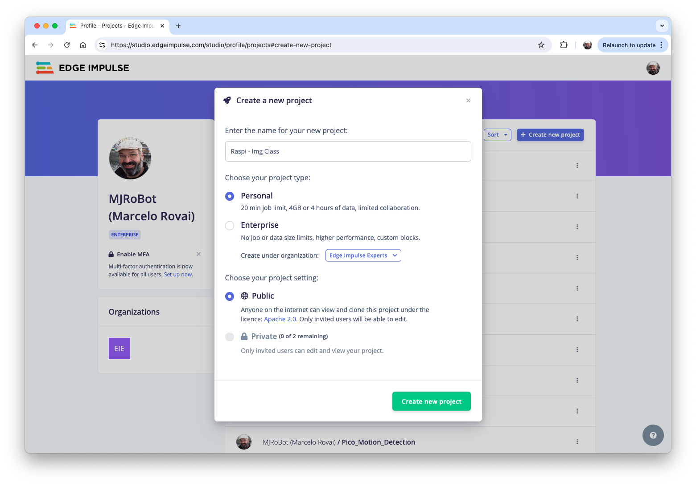
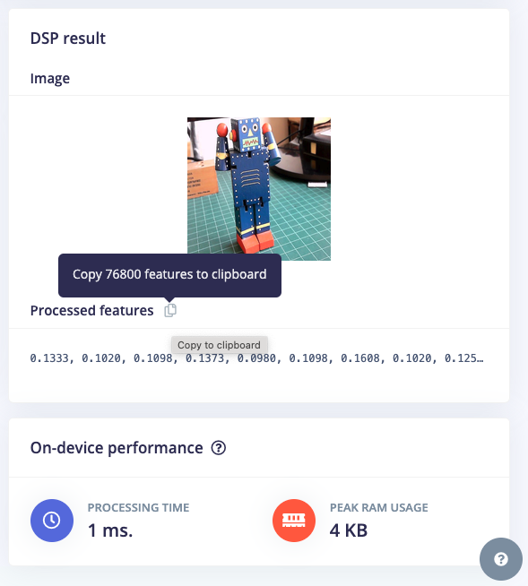
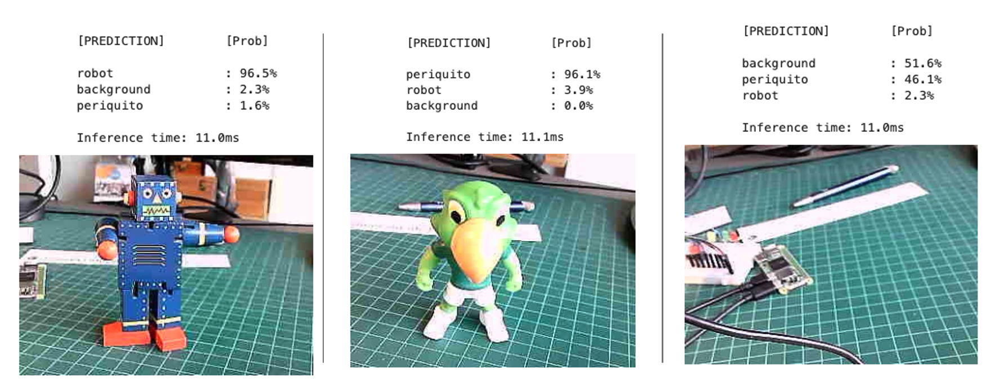

We will use the Edge Impulse Studio to train our model. Go to the  [Edge Impulse Page](https://edgeimpulse.com/), enter your account credentials, and create a new project:



> Here, you can clone a similar project: [Raspi - Img Class](https://studio.edgeimpulse.com/public/510251/live).

### Dataset

We will walk through four main steps using the EI Studio (or Studio). These steps are crucial in preparing our model for use on the Raspi: Dataset, Impulse, Tests, and Deploy (on the Edge Device, in this case, the Raspi).

> Regarding the Dataset, it is essential to point out that our Original Dataset, captured with the Raspi, will be split into *Training*, *Validation*, and *Test*. The Test Set will be separated from the beginning and reserved for use only in the Test phase after training. The Validation Set will be used during training.
>

On Studio, follow the steps to upload the captured data:

1. Go to the `Data acquisition` tab, and in the `UPLOAD DATA` section, upload the files from your computer in the chosen categories.
2. Leave to the Studio the splitting of the original dataset into *train and test* and choose the label about
3. Repeat the procedure for all three classes. At the end, you should see your "raw data" in the Studio:


The Studio allows you to explore your data, showing a complete view of all the data in your project. You can clear, inspect, or change labels by clicking on individual data items. In our case, a straightforward project, the data seems OK.


## The Impulse Design

In this phase, we should define how to:

- Pre-process our data, which consists of resizing the individual images and determining the `color depth` to use (be it RGB or Grayscale) and

- Specify a Model. In this case, it will be the `Transfer Learning (Images)` to fine-tune a pre-trained MobileNet V2 image classification model on our data. This method performs well even with relatively small image datasets (around 180 images in our case).

Transfer Learning with MobileNet offers a streamlined approach to model training, which is especially beneficial for resource-constrained environments and projects with limited labeled data. MobileNet, known for its lightweight architecture, is a pre-trained model that has already learned valuable features from a large dataset (ImageNet).


By leveraging these learned features, we can train a new model for your specific task with fewer data and computational resources and achieve competitive accuracy.


This approach significantly reduces training time and computational cost, making it ideal for quick prototyping and deployment on embedded devices where efficiency is paramount.

Go to the Impulse Design Tab and create the *impulse*, defining an image size of 160x160 and squashing them (squared form, without cropping). Select Image and Transfer Learning blocks. Save the Impulse.


### Image Pre-Processing

All the input QVGA/RGB565 images will be converted to 76,800 features (160x160x3).



Press `Save parameters` and select `Generate features` in the next tab.

### Model Design

MobileNet is a family of efficient convolutional neural networks designed for mobile and embedded vision applications. The key features of MobileNet are:

1. Lightweight: Optimized for mobile devices and embedded systems with limited computational resources.
2. Speed: Fast inference times, suitable for real-time applications.
3. Accuracy: Maintains good accuracy despite its compact size.

[MobileNetV2](https://arxiv.org/abs/1801.04381), introduced in 2018, improves the original MobileNet architecture. Key features include:

1. Inverted Residuals: Inverted residual structures are used where shortcut connections are made between thin bottleneck layers.
2. Linear Bottlenecks: Removes non-linearities in the narrow layers to prevent the destruction of information.
3. Depth-wise Separable Convolutions: Continues to use this efficient operation from MobileNetV1.

In our project, we will do a `Transfer Learning` with the `MobileNetV2 160x160 1.0`,  which means that the images used for training (and future inference) should have an *input Size* of 160x160 pixels and a *Width Multiplier* of 1.0 (full width, not reduced). This configuration balances between model size, speed, and accuracy.

### Model Training

Another valuable deep learning technique is **Data Augmentation**. Data augmentation improves the accuracy of machine learning models by creating additional artificial data. A data augmentation system makes small, random changes to the training data during the training process (such as flipping, cropping, or rotating the images).

Looking under the hood, here you can see how Edge Impulse implements a data Augmentation policy on your data:

``` python
# Implements the data augmentation policy
def augment_image(image, label):
    # Flips the image randomly
    image = tf.image.random_flip_left_right(image)

    # Increase the image size, then randomly crop it down to
    # the original dimensions
    resize_factor = random.uniform(1, 1.2)
    new_height = math.floor(resize_factor * INPUT_SHAPE[0])
    new_width = math.floor(resize_factor * INPUT_SHAPE[1])
    image = tf.image.resize_with_crop_or_pad(image, new_height, new_width)
    image = tf.image.random_crop(image, size=INPUT_SHAPE)

    # Vary the brightness of the image
    image = tf.image.random_brightness(image, max_delta=0.2)

    return image, label
```

Exposure to these variations during training can help prevent your model from taking shortcuts by "memorizing" superficial clues in your training data, meaning it may better reflect the deep underlying patterns in your dataset.

The final dense layer of our model will have 0 neurons with a 10% dropout for overfitting prevention. The model output has a Softmax function as activation. Here is the Training result:


The result is excellent, with a reasonable 35ms of latency (for a Rasp-4), which should result in around 30 fps (frames per second) during inference. A Raspi-Zero should be slower, and the Rasp-5, faster. 

### Trading off: Accuracy versus speed

If faster inference is needed, we should train the model using smaller alphas (0.35, 0.5, and 0.75) or even reduce the image input size, trading with accuracy. However, reducing the input image size and decreasing the alpha (width multiplier) can speed up inference for MobileNet V2, but they have different trade-offs. Let's compare:

1. Reducing Image Input Size:

Pros:
- Significantly reduces the computational cost across all layers.
- Decreases memory usage.
- It often provides a substantial speed boost.

Cons:
- It may reduce the model's ability to detect small features or fine details.
- It can significantly impact accuracy, especially for tasks requiring fine-grained recognition.

2. Reducing Alpha (Width Multiplier):

Pros:
- Reduces the number of parameters and computations in the model.
- Maintains the original input resolution, potentially preserving more detail.
- It can provide a good balance between speed and accuracy.

Cons:
- It may not speed up inference as dramatically as reducing input size.
- It can reduce the model's capacity to learn complex features.

Comparison:

1. Speed Impact: 
   - Reducing input size often provides a more substantial speed boost because it reduces computations quadratically (halving both width and height reduces computations by about 75%).
   - Reducing alpha provides a more linear reduction in computations.

2. Accuracy Impact:
   - Reducing input size can severely impact accuracy, especially when detecting small objects or fine details.
   - Reducing alpha tends to have a more gradual impact on accuracy.

3. Model Architecture:
   - Changing input size doesn't alter the model's architecture.
   - Changing alpha modifies the model's structure by reducing the number of channels in each layer.

Recommendation:

1. If our application doesn't require detecting tiny details and can tolerate some loss in accuracy, reducing the input size is often the most effective way to speed up inference.
2. Reducing alpha might be preferable if maintaining the ability to detect fine details is crucial or if you need a more balanced trade-off between speed and accuracy.
3. For best results, you might want to experiment with both:
   - Try MobileNet V2 with input sizes like 160x160 or 92x92
   - Experiment with alpha values like 1.0, 0.75, 0.5 or 0.35.
5. Always benchmark the different configurations on your specific hardware and with your particular dataset to find the optimal balance for your use case.

> Remember, the best choice depends on your specific requirements for accuracy, speed, and the nature of the images you're working with. It's often worth experimenting with combinations to find the optimal configuration for your particular use case.
>

### Model Testing

Now, you should take the data set aside at the start of the project and run the trained model using it as input. Again, the result is excellent (92.22%).

### Deploying the model

As we did in the previous section, we can deploy the trained model as .tflite and use Raspi to run it using Python.

On the `Dashboard` tab, go to Transfer learning model (int8 quantized) and click on the download icon:


> Let's also download the float32 version for comparasion

Transfer the model from your computer to the Raspi (./models), for example, using FileZilla. Also, capture some images for inference (./images). 

Import the needed libraries:

```python
import time
import numpy as np
import matplotlib.pyplot as plt
from PIL import Image
import tflite_runtime.interpreter as tflite
```

Define the paths and labels:

```python
img_path = "./images/robot.jpg"
model_path = "./models/ei-raspi-img-class-int8-quantized-model.tflite"
labels = ['background', 'periquito', 'robot']
```

> Note that the models trained on the Edge Impulse Studio will output values with index 0, 1, 2, etc., where the actual labels will follow an alphabetic order.

Load the model, allocate the tensors and get the input and output tensor details:

```python
# Load the TFLite model
interpreter = tflite.Interpreter(model_path=model_path)
interpreter.allocate_tensors()

# Get input and output tensors
input_details = interpreter.get_input_details()
output_details = interpreter.get_output_details()
```

One inportant difference to note, is that the `dtype` of the input details of the model are now `int8`, wich means that the input values goes from -128 to +127, while each pixel of outr image goes form 0 to 256. This means that we should pre-process the image t mach it. We can check here:

```python
input_dtype = input_details[0]['dtype']
input_dtype
```

```
numpy.int8
```

So, let's open the image show it:

```python
img = Image.open(img_path)
plt.figure(figsize=(4, 4))
plt.imshow(img)
plt.axis('off')
plt.show()
```


And perform the pre-processing:

```python
scale, zero_point = input_details[0]['quantization']
img = img.resize((input_details[0]['shape'][1], 
                  input_details[0]['shape'][2]))
img_array = np.array(img, dtype=np.float32) / 255.0
img_array = (img_array / scale + zero_point).clip(-128, 127).astype(np.int8)
input_data = np.expand_dims(img_array, axis=0)
```

Checking the input data, we can verify that the input tensor is compatible with what is expected by the model:

```python
input_data.shape, input_data.dtype
```

```
((1, 160, 160, 3), dtype('int8'))
```

Now, it is time to perform the inference. Let's also calculate the latency of the model:

```python
# Inference on Raspi-Zero
start_time = time.time()
interpreter.set_tensor(input_details[0]['index'], input_data)
interpreter.invoke()
end_time = time.time()
inference_time = (end_time - start_time) * 1000  # Convert to milliseconds
print ("Inference time: {:.1f}ms".format(inference_time))
```

The model will take around 125ms to perform the inference in the Raspi-Zero. This time is 3 to 4 times longer than a Raspi-5. 

Now, we can get the output labels and probabilities. It is also importnat to note that the model trained on the Edge Impulse Studio has a softmax in its output (different from the original Movilenet V2), and we should use the raw output of the model as the "probabilities".

```python
# Obtain results and map them to the classes
predictions = interpreter.get_tensor(output_details[0]['index'])[0]

# Get indices of the top k results
top_k_results=3
top_k_indices = np.argsort(predictions)[::-1][:top_k_results]

# Get quantization parameters
scale, zero_point = output_details[0]['quantization']

# Dequantize the output
dequantized_output = (predictions.astype(np.float32) - zero_point) * scale
probabilities = dequantized_output

print("\n\t[PREDICTION]        [Prob]\n")
for i in range(top_k_results):
    print("\t{:20}: {:.2f}%".format(
        labels[top_k_indices[i]],
        probabilities[top_k_indices[i]] * 100))
```


Let's modify the function created before, so we can handle different type of models:

```python
def image_classification(img_path, model_path, labels, top_k_results=3, apply_softmax=False):
    # Load the image
    img = Image.open(img_path)
    plt.figure(figsize=(4, 4))
    plt.imshow(img)
    plt.axis('off')

    # Load the TFLite model
    interpreter = tflite.Interpreter(model_path=model_path)
    interpreter.allocate_tensors()

    # Get input and output tensors
    input_details = interpreter.get_input_details()
    output_details = interpreter.get_output_details()

    # Preprocess
    img = img.resize((input_details[0]['shape'][1], 
                      input_details[0]['shape'][2]))
    
    input_dtype = input_details[0]['dtype']
    
    if input_dtype == np.uint8:
        input_data = np.expand_dims(np.array(img), axis=0)
    elif input_dtype == np.int8:
        scale, zero_point = input_details[0]['quantization']
        img_array = np.array(img, dtype=np.float32) / 255.0
        img_array = (img_array / scale + zero_point).clip(-128, 127).astype(np.int8)
        input_data = np.expand_dims(img_array, axis=0)
    else:  # float32
        input_data = np.expand_dims(np.array(img, dtype=np.float32), axis=0) / 255.0

    # Inference on Raspi-Zero
    start_time = time.time()
    interpreter.set_tensor(input_details[0]['index'], input_data)
    interpreter.invoke()
    end_time = time.time()
    inference_time = (end_time - start_time) * 1000  # Convert to milliseconds

    # Obtain results
    predictions = interpreter.get_tensor(output_details[0]['index'])[0]

    # Get indices of the top k results
    top_k_indices = np.argsort(predictions)[::-1][:top_k_results]

    # Handle output based on type
    output_dtype = output_details[0]['dtype']
    if output_dtype in [np.int8, np.uint8]:
        # Dequantize the output
        scale, zero_point = output_details[0]['quantization']
        predictions = (predictions.astype(np.float32) - zero_point) * scale
    
    if apply_softmax:
        # Apply softmax
        exp_preds = np.exp(predictions - np.max(predictions))
        probabilities = exp_preds / np.sum(exp_preds)
    else:
        probabilities = predictions

    print("\n\t[PREDICTION]        [Prob]\n")
    for i in range(top_k_results):
        print("\t{:20}: {:.1f}%".format(
            labels[top_k_indices[i]],
            probabilities[top_k_indices[i]] * 100))
    print ("\n\tInference time: {:.1f}ms".format(inference_time))

```

And test it with different images and the int8 quantized model (**160x160 alpha =1.0**). 


Let's download a smaller model, such as the one trained for the [Nicla Vision Lab](https://studio.edgeimpulse.com/public/353482/live) (int8 quantized model (96x96 alpha = 0.1), as a test. We can use the same function:



The model lost some accuracy, but it is still OK once our model does not look for many details. Regarding latency, we are around **ten times faster** on the Rasp-Zero. 

## Live Image Classification

Let's develop an app to capture images with the USB camera in real time, showing its classification. 

Using the nano on the terminal, save the code below, such as `img_class_live_infer.py`. 

```python
from flask import Flask, Response, render_template_string, request, jsonify
from picamera2 import Picamera2
import io
import threading
import time
import numpy as np
from PIL import Image
import tflite_runtime.interpreter as tflite
from queue import Queue

app = Flask(__name__)

# Global variables
picam2 = None
frame = None
frame_lock = threading.Lock()
is_classifying = False
confidence_threshold = 0.8
model_path = "./models/ei-raspi-img-class-int8-quantized-model.tflite"
labels = ['background', 'periquito', 'robot']
interpreter = None
classification_queue = Queue(maxsize=1)

def initialize_camera():
    global picam2
    picam2 = Picamera2()
    config = picam2.create_preview_configuration(main={"size": (320, 240)})
    picam2.configure(config)
    picam2.start()
    time.sleep(2)  # Wait for camera to warm up

def get_frame():
    global frame
    while True:
        stream = io.BytesIO()
        picam2.capture_file(stream, format='jpeg')
        with frame_lock:
            frame = stream.getvalue()
        time.sleep(0.1)  # Capture frames more frequently

def generate_frames():
    while True:
        with frame_lock:
            if frame is not None:
                yield (b'--frame\r\n'
                       b'Content-Type: image/jpeg\r\n\r\n' + frame + b'\r\n')
        time.sleep(0.1)

def load_model():
    global interpreter
    if interpreter is None:
        interpreter = tflite.Interpreter(model_path=model_path)
        interpreter.allocate_tensors()
    return interpreter

def classify_image(img, interpreter):
    input_details = interpreter.get_input_details()
    output_details = interpreter.get_output_details()

    img = img.resize((input_details[0]['shape'][1], input_details[0]['shape'][2]))
    input_data = np.expand_dims(np.array(img), axis=0).astype(input_details[0]['dtype'])

    interpreter.set_tensor(input_details[0]['index'], input_data)
    interpreter.invoke()

    predictions = interpreter.get_tensor(output_details[0]['index'])[0]
    # Handle output based on type
    output_dtype = output_details[0]['dtype']
    if output_dtype in [np.int8, np.uint8]:
        # Dequantize the output
        scale, zero_point = output_details[0]['quantization']
        predictions = (predictions.astype(np.float32) - zero_point) * scale
    return predictions

def classification_worker():
    interpreter = load_model()
    while True:
        if is_classifying:
            with frame_lock:
                if frame is not None:
                    img = Image.open(io.BytesIO(frame))
            predictions = classify_image(img, interpreter)
            max_prob = np.max(predictions)
            if max_prob >= confidence_threshold:
                label = labels[np.argmax(predictions)]
            else:
                label = 'Uncertain'
            classification_queue.put({'label': label, 'probability': float(max_prob)})
        time.sleep(0.1)  # Adjust based on your needs

@app.route('/')
def index():
    return render_template_string('''
        <!DOCTYPE html>
        <html>
        <head>
            <title>Image Classification</title>
            <script src="https://code.jquery.com/jquery-3.6.0.min.js"></script>
            <script>
                function startClassification() {
                    $.post('/start');
                    $('#startBtn').prop('disabled', true);
                    $('#stopBtn').prop('disabled', false);
                }
                function stopClassification() {
                    $.post('/stop');
                    $('#startBtn').prop('disabled', false);
                    $('#stopBtn').prop('disabled', true);
                }
                function updateConfidence() {
                    var confidence = $('#confidence').val();
                    $.post('/update_confidence', {confidence: confidence});
                }
                function updateClassification() {
                    $.get('/get_classification', function(data) {
                        $('#classification').text(data.label + ': ' + data.probability.toFixed(2));
                    });
                }
                $(document).ready(function() {
                    setInterval(updateClassification, 100);  // Update every 100ms
                });
            </script>
        </head>
        <body>
            <h1>Image Classification</h1>
            
            <br>
            <button id="startBtn" onclick="startClassification()">Start Classification</button>
            <button id="stopBtn" onclick="stopClassification()" disabled>Stop Classification</button>
            <br>
            <label for="confidence">Confidence Threshold:</label>
            <input type="number" id="confidence" name="confidence" min="0" max="1" step="0.1" value="0.8" onchange="updateConfidence()">
            <br>
            <div id="classification">Waiting for classification...</div>
        </body>
        </html>
    ''')

@app.route('/video_feed')
def video_feed():
    return Response(generate_frames(),
                    mimetype='multipart/x-mixed-replace; boundary=frame')

@app.route('/start', methods=['POST'])
def start_classification():
    global is_classifying
    is_classifying = True
    return '', 204

@app.route('/stop', methods=['POST'])
def stop_classification():
    global is_classifying
    is_classifying = False
    return '', 204

@app.route('/update_confidence', methods=['POST'])
def update_confidence():
    global confidence_threshold
    confidence_threshold = float(request.form['confidence'])
    return '', 204

@app.route('/get_classification')
def get_classification():
    if not is_classifying:
        return jsonify({'label': 'Not classifying', 'probability': 0})
    try:
        result = classification_queue.get_nowait()
    except Queue.Empty:
        result = {'label': 'Processing', 'probability': 0}
    return jsonify(result)

if __name__ == '__main__':
    initialize_camera()
    threading.Thread(target=get_frame, daemon=True).start()
    threading.Thread(target=classification_worker, daemon=True).start()
    app.run(host='0.0.0.0', port=5000, threaded=True)

```

On the terminal, run:

```bash
python3 img_class_live_infer.py
```

And access the web interface:

- On the Raspberry Pi itself (if you have a GUI): Open a web browser and go to `http://localhost:5000`
- From another device on the same network: Open a web browser and go to `http://<raspberry_pi_ip>:5000` (Replace `<raspberry_pi_ip>` with your Raspberry Pi's IP address). For example: `http://192.168.4.210:5000/`

Here are some screenshots of the app running on an external desktop


Here, you can see the app running on the YouTube:

 https://youtu.be/o1QsQrpCMw4?si=6_sDAsqKejJ23qlF

The code creates a web application for real-time image classification using a Raspberry Pi, its camera module, and a TensorFlow Lite model. The application uses Flask to serve a web interface where is possible to view the camera feed and see live classification results.

#### Key Components:

1. **Flask Web Application**: Serves the user interface and handles requests.
2. **PiCamera2**: Captures images from the Raspberry Pi camera module.
3. **TensorFlow Lite**: Runs the image classification model.
4. **Threading**: Manages concurrent operations for smooth performance.

#### Main Features:

- Live camera feed display
- Real-time image classification
- Adjustable confidence threshold
- Start/Stop classification on demand

#### Code Structure:

1. **Imports and Setup**:
   - Flask for web application
   - PiCamera2 for camera control
   - TensorFlow Lite for inference
   - Threading and Queue for concurrent operations

2. **Global Variables**:
   - Camera and frame management
   - Classification control
   - Model and label information

3. **Camera Functions**:
   - `initialize_camera()`: Sets up the PiCamera2
   - `get_frame()`: Continuously captures frames
   - `generate_frames()`: Yields frames for the web feed

4. **Model Functions**:
   - `load_model()`: Loads the TFLite model
   - `classify_image()`: Performs inference on a single image

5. **Classification Worker**:
   - Runs in a separate thread
   - Continuously classifies frames when active
   - Updates a queue with the latest results

6. **Flask Routes**:
   - `/`: Serves the main HTML page
   - `/video_feed`: Streams the camera feed
   - `/start` and `/stop`: Controls classification
   - `/update_confidence`: Adjusts the confidence threshold
   - `/get_classification`: Returns the latest classification result

7. **HTML Template**:
   - Displays camera feed and classification results
   - Provides controls for starting/stopping and adjusting settings

8. **Main Execution**:
   - Initializes camera and starts necessary threads
   - Runs the Flask application

#### Key Concepts:

1. **Concurrent Operations**: Using threads to handle camera capture and classification separately from the web server.
2. **Real-time Updates**: Frequent updates to the classification results without page reloads.
3. **Model Reuse**: Loading the TFLite model once and reusing it for efficiency.
4. **Flexible Configuration**: Allowing users to adjust the confidence threshold on the fly.

#### Usage:

1. Ensure all dependencies are installed.
2. Run the script on a Raspberry Pi with a camera module.
3. Access the web interface from a browser using the Raspberry Pi's IP address.
4. Start classification and adjust settings as needed.

Based on the comprehensive content provided, here's a suggested conclusion for the Image Classification chapter:

## Conclusion:

Image classification has emerged as a powerful and versatile application of machine learning, with significant implications for various fields, from healthcare to environmental monitoring. This chapter has demonstrated how to implement a robust image classification system on edge devices like the Raspi-Zero and Rasp-5, showcasing the potential for real-time, on-device intelligence.

We've explored the entire pipeline of an image classification project, from data collection and model training using Edge Impulse Studio to deploying and running inferences on a Raspi. The process highlighted several key points:

1. The importance of proper data collection and preprocessing for training effective models.
2. The power of transfer learning, allowing us to leverage pre-trained models like MobileNet V2 for efficient training with limited data.
3. The trade-offs between model accuracy and inference speed, especially crucial for edge devices.
4. The implementation of real-time classification using a web-based interface, demonstrating practical applications.

The ability to run these models on edge devices like the Raspi opens up numerous possibilities for IoT applications, autonomous systems, and real-time monitoring solutions. It allows for reduced latency, improved privacy, and operation in environments with limited connectivity.

As we've seen, even with the computational constraints of edge devices, it's possible to achieve impressive results in terms of both accuracy and speed. The flexibility to adjust model parameters, such as input size and alpha values, allows for fine-tuning to meet specific project requirements.

Looking forward, the field of edge AI and image classification continues to evolve rapidly. Advances in model compression techniques, hardware acceleration, and more efficient neural network architectures promise to further expand the capabilities of edge devices in computer vision tasks.

This project serves as a foundation for more complex computer vision applications and encourages further exploration into the exciting world of edge AI and IoT. Whether it's for industrial automation, smart home applications, or environmental monitoring, the skills and concepts covered here provide a solid starting point for a wide range of innovative projects.

## Resources

- [Dataset Example](https://github.com/Mjrovai/EdgeML-with-Raspberry-Pi/tree/main/IMG_CLASS/dataset)

- [Setup Test Notebook](https://github.com/Mjrovai/EdgeML-with-Raspberry-Pi/blob/main/IMG_CLASS/notebooks/setup_test.ipynb)

- [Image Classification Notebook](https://github.com/Mjrovai/EdgeML-with-Raspberry-Pi/blob/main/IMG_CLASS/notebooks/10_Image_Classification.ipynb)

- [Python Scripts](https://github.com/Mjrovai/EdgeML-with-Raspberry-Pi/tree/main/IMG_CLASS/python_scripts)

- [Edge Impulse Project](https://studio.edgeimpulse.com/public/510251/live)